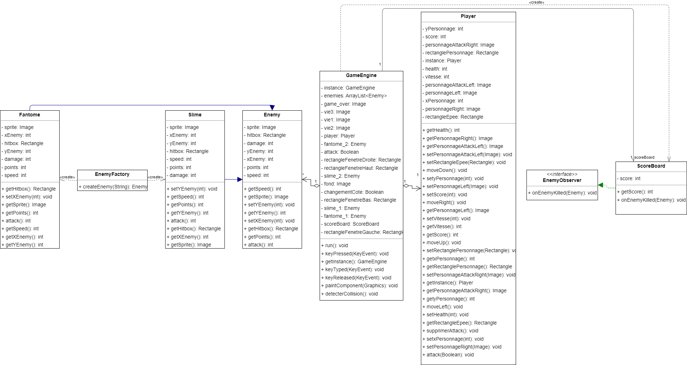

Pour ce projet, nous avons utilisé trois design patterns différents afin de structurer notre code. 

## Singleton

Le pattern Singleton est utilisé pour s'assurer qu'il n'y a qu'une seule instance d'une classe donnée.
Nous utilisons ce pattern pour garantir qu'il n'y a qu'un seul objet GameEngine dans notre jeu, afin d'éviter des problèmes de concurrence.

## Observer 

Le pattern Observer est utilisé pour permettre à plusieurs objets d'être informés des changements d'état d'un objet. 
Nous utilisons ce pattern pour permettre à la classe ScoreBoard (qui s'occupe de compter le score du joueur) d'être notifiée lorsqu'un ennemi est tué.

## Factory

Le pattern Factory est utilisé pour créer des objets sans avoir à spécifier la classe exacte de l'objet que l'on souhaite créer.
Nous utilisons ce pattern pour créer des objets de type Fantome ou de type Slime sans avoir à spécifier la classe exacte de l'objet que l'on souhaite créer.

## Diagramme UML du projet

 
 
<b>Ce projet a été réalisé par : Arthur Wlodarczak et Alex Degouzon </b>
